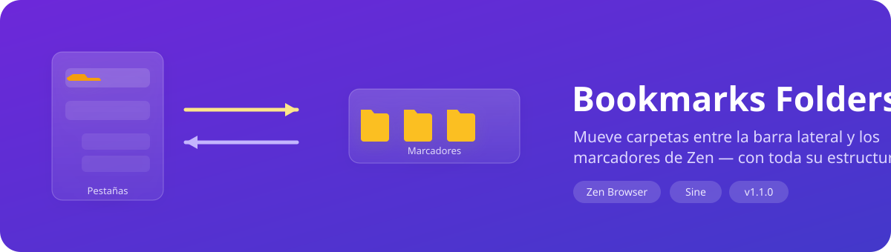
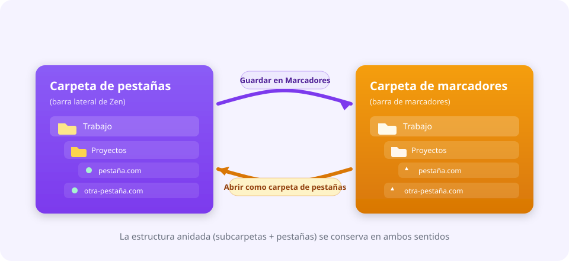

<div align="center">



# Bookmarks Folders Bridge

**Move folders between Zen's tab sidebar and the bookmarks bar — keeping the whole nested structure.**
**Mueve carpetas entre la barra lateral de pestañas de Zen y la barra de marcadores — conservando toda su estructura anidada.**


**[English](#english) · [Español](#español)**

</div>

---

# English

## ✨ What it does

Zen lets you organize tabs into **folders** in the sidebar, and bookmarks into folders on the bookmarks bar. Moving a folder from one side to the other by hand is tedious.

This mod adds two context-menu (right-click) entries that bridge **both directions**, preserving subfolders and tabs:



| Direction | Where you right-click | Entry | Result |
|---|---|---|---|
| **Tabs → Bookmarks** | A folder in the sidebar | 📌 *Save to Bookmarks…* | Creates a copy of the folder (with subfolders and tabs) as bookmarks. |
| **Bookmarks → Tabs** | A folder on the bookmarks bar | 📂 *Open as tab folder…* | Recreates the folder as pinned tabs inside the workspace you pick. |

## 🎯 Features

- **Bidirectional:** tabs to bookmarks and back.
- **Structure preserved:** nested subfolders survive both conversions.
- **Non-destructive:** saving never closes your tabs, opening never deletes your bookmarks — it always creates a copy.
- **Pick the destination:** a tree picker lets you choose the target bookmark folder, or the target **workspace** (and subfolder).
- **Skips the noise:** empty tabs (`about:newtab`, `about:blank`) are ignored when saving.
- **Bilingual:** the mod UI follows Zen's language (English or Spanish).

## 📋 Requirements

- A recent **[Zen Browser](https://zen-browser.app/)** (with the *workspaces* and *folders* APIs).
- **[Sine](https://github.com/CosmoCreeper/Sine)**, installed with its official installer (see the [Sine docs](https://github.com/sineorg/docs/blob/main/src/installation.md)).
- Sine's **"Enable installing JS from unofficial sources"** option turned on — this is the `sine.allow-unsafe-js` preference set to `true`. Without it Sine downloads the mod but **never loads its `.uc.js` file**, so the mod looks installed and does nothing.

> ⚠️ **This is the most common failure.** Turn that option on **before** installing the mod, and restart Zen afterwards.

## 🚀 Installation

### Option A — Through Sine, from GitHub (recommended)

1. Open **`about:preferences`** in Zen and go to the **Sine** section.
2. In Sine's settings, enable **"Enable installing JS from unofficial sources"**
   (equivalent to setting `sine.allow-unsafe-js = true` in `about:config`).
3. In the **"or, add your own locally from a GitHub repo"** field (placeholder `username/repo`), paste:
   ```
   piero-valles-maravi/zen-mod-bookmarks-folders-bridge
   ```
4. Click **Install**.
5. **Restart Zen.** JavaScript mods are only fully loaded after a restart (Sine says so itself: *"For it to work properly, restart your browser"*).
6. Verify: open the browser console with `Ctrl+Shift+J` and look for `[BFBridge] v1.1.0 loaded ✅`.

### Option B — Manual installation

Sine has no "install from a local folder" button: besides copying the files you must **register the mod** in its `mods.json` index.

1. Clone or download the repository:
   ```bash
   git clone https://github.com/piero-valles-maravi/zen-mod-bookmarks-folders-bridge.git
   ```
2. Open `about:profiles` in Zen and find your profile's **root directory**. Copy the repo contents into:
   ```
   <profile>/chrome/sine-mods/bookmarks-folders-bridge/
   ```
   (`main.uc.js`, `chrome.css`, `theme.json` and `preferences.json` must end up there).
3. Edit `<profile>/chrome/sine-mods/mods.json` (create it with `{}` if missing) and add this entry to the root object:
   ```json
   "bookmarks-folders-bridge": {
     "id": "bookmarks-folders-bridge",
     "name": "Bookmarks Folders Bridge",
     "description": "Move folders between the tab sidebar and the bookmarks bar.",
     "author": "pvalles",
     "version": "1.1.0",
     "homepage": "piero-valles-maravi/zen-mod-bookmarks-folders-bridge",
     "style": { "chrome": "chrome.css", "content": "" },
     "scripts": {
       "main.uc.js": {
         "include": ["chrome://browser/content/browser.xhtml"],
         "loadOrder": 1
       }
     },
     "preferences": "preferences.json",
     "supportsUnload": false,
     "enabled": true,
     "no-updates": true,
     "updatedAt": "2026-01-01T00:00:00Z"
   }
   ```
4. Make sure `sine.allow-unsafe-js` is `true` in `about:config`.
5. Restart Zen.

## 🖱️ Usage

### Save a tab folder to bookmarks
1. Right-click any **folder in the sidebar**.
2. Choose **📌 Save to Bookmarks…**.
3. Pick the destination bookmark folder in the tree.
4. Click **Save**.

### Open a bookmark folder as tabs
1. Right-click any **folder on the bookmarks bar**.
2. Choose **📂 Open as tab folder…**.
3. Pick the target **workspace**.
4. *(Optional)* Pick a subfolder to nest it into; otherwise it lands at the workspace root.
5. Click **Open**.

## ⚙️ Preferences

Available in the mod's settings inside Sine:

| Preference | Default | Description |
|---|---|---|
| Include empty tabs when saving | `off` | Whether `about:newtab` / `about:blank` tabs are bookmarked too. |
| Open imported tabs in the background | `on` | Whether imported tabs open without stealing focus. |

## 🩺 Troubleshooting

**I installed the mod and no new right-click entry shows up.**

Check these in order:

1. **Is unofficial JS enabled?** In `about:config`, `sine.allow-unsafe-js` must be `true`. If the preference does not exist, create it as a *Boolean* set to `true`, then **restart Zen**.
2. **Did you restart after installing?** Sine cannot hot-load a freshly installed `.uc.js` mod.
3. **Did the script load?** Open the browser console (`Ctrl+Shift+J`) and search for `[BFBridge]`. You should see `v1.1.0 loaded ✅`.
   - Nothing at all means Sine is not running the file: revisit steps 1 and 2, or reinstall the mod.
   - `Zen folders/workspaces API not available` means you are in a private window or on a Zen build without folders.
4. **Are the files there?** Check that `<profile>/chrome/sine-mods/bookmarks-folders-bridge/main.uc.js` exists and that the mod is listed in `<profile>/chrome/sine-mods/mods.json`.
5. **Did you install using the old repository name?** The repo was renamed to `zen-mod-bookmarks-folders-bridge`. Uninstall the mod in Sine and reinstall it with the new identifier.

**The bookmarks entry appears but says it cannot identify the folder.** Make sure you right-click an actual bookmark **folder**, not a single bookmark or empty space on the bar.

## 📝 Notes and limitations

- Saving a tab folder to bookmarks does **not** close the tabs: it creates a bookmark copy.
- Opening a bookmark folder does **not** delete the bookmarks: it only creates new tabs.
- Empty tabs (`about:newtab`, `about:blank`) are skipped when saving, unless you enable the matching preference.
- Built for recent Zen versions with the *workspaces* and *folders* APIs; very old builds may not work.
- It does not run in private windows: Zen disables folders there.

## 🗑️ Uninstall

Disable or remove **Bookmarks Folders Bridge** from Sine's mod manager. If you installed it manually, delete `chrome/sine-mods/bookmarks-folders-bridge/` from your profile, remove its entry from `mods.json` and restart Zen.

---

# Español

## ✨ ¿Qué hace?

Zen te deja organizar pestañas en **carpetas** dentro de la barra lateral, y también guardar **marcadores** en carpetas en la barra de marcadores. Pero mover una carpeta de un lado al otro, a mano, es tedioso.

Este mod añade dos opciones al menú contextual (clic derecho) que hacen el puente en **ambos sentidos**, respetando subcarpetas y pestañas:


| Dirección | Dónde haces clic derecho | Opción | Resultado |
|---|---|---|---|
| **Pestañas → Marcadores** | Una carpeta en la barra lateral | 📌 *Guardar en Marcadores…* | Crea una copia de la carpeta (con subcarpetas y pestañas) como marcadores. |
| **Marcadores → Pestañas** | Una carpeta en la barra de marcadores | 📂 *Abrir como carpeta de pestañas…* | Recrea la carpeta como pestañas ancladas dentro del workspace que elijas. |

## 🎯 Características

- **Bidireccional:** de pestañas a marcadores y viceversa.
- **Estructura preservada:** las subcarpetas anidadas se mantienen en ambos sentidos.
- **No destructivo:** guardar no cierra tus pestañas y abrir no borra tus marcadores — siempre crea una copia.
- **Elige el destino:** un selector con árbol te deja escoger en qué carpeta de marcadores guardar, o en qué **workspace** (y subcarpeta) abrir.
- **Limpia el ruido:** ignora pestañas vacías (`about:newtab`, `about:blank`) al guardar.
- **Bilingüe:** la interfaz del mod sigue el idioma de Zen (inglés o español).

## 📋 Requisitos

- **[Zen Browser](https://zen-browser.app/)** en una versión reciente (con la API de *workspaces* y *folders*).
- **[Sine](https://github.com/CosmoCreeper/Sine)** instalado con su instalador oficial (ver [documentación de Sine](https://github.com/sineorg/docs/blob/main/src/installation.md)).
- La opción de Sine **«Enable installing JS from unofficial sources»** activada — equivale a la preferencia `sine.allow-unsafe-js` en `true`. Sin ella, Sine descarga el mod pero **nunca carga su archivo `.uc.js`**, así que el mod aparece instalado y no hace nada.

> ⚠️ **Este es el fallo más común.** Activa esa opción **antes** de instalar el mod y reinicia Zen después de instalarlo.

## 🚀 Instalación

### Opción A — Con Sine desde GitHub (recomendada)

1. Abre **`about:preferences`** en Zen y entra a la sección **Sine**.
2. En los ajustes de Sine, activa **«Enable installing JS from unofficial sources»**
   (equivale a poner `sine.allow-unsafe-js = true` en `about:config`).
3. En el campo **«or, add your own locally from a GitHub repo»** (placeholder `username/repo`), pega:
   ```
   piero-valles-maravi/zen-mod-bookmarks-folders-bridge
   ```
4. Pulsa **Install**.
5. **Reinicia Zen.** Los mods con JavaScript solo se cargan del todo tras reiniciar (Sine mismo lo avisa con un toast: *«For it to work properly, restart your browser»*).
6. Verifica: abre la consola del navegador con `Ctrl+Shift+J` y busca la línea `[BFBridge] v1.1.0 loaded ✅`.

### Opción B — Instalación manual

Sine no tiene un botón para instalar desde una carpeta local: además de copiar los archivos hay que **registrar el mod** en su índice `mods.json`.

1. Clona o descarga el repositorio:
   ```bash
   git clone https://github.com/piero-valles-maravi/zen-mod-bookmarks-folders-bridge.git
   ```
2. Abre `about:profiles` en Zen y localiza el **directorio raíz** de tu perfil. Copia el contenido del repo en:
   ```
   <perfil>/chrome/sine-mods/bookmarks-folders-bridge/
   ```
   (deben quedar ahí `main.uc.js`, `chrome.css`, `theme.json` y `preferences.json`).
3. Edita `<perfil>/chrome/sine-mods/mods.json` (créalo con `{}` si no existe) y añade esta entrada dentro del objeto raíz:
   ```json
   "bookmarks-folders-bridge": {
     "id": "bookmarks-folders-bridge",
     "name": "Bookmarks Folders Bridge",
     "description": "Move folders between the tab sidebar and the bookmarks bar.",
     "author": "pvalles",
     "version": "1.1.0",
     "homepage": "piero-valles-maravi/zen-mod-bookmarks-folders-bridge",
     "style": { "chrome": "chrome.css", "content": "" },
     "scripts": {
       "main.uc.js": {
         "include": ["chrome://browser/content/browser.xhtml"],
         "loadOrder": 1
       }
     },
     "preferences": "preferences.json",
     "supportsUnload": false,
     "enabled": true,
     "no-updates": true,
     "updatedAt": "2026-01-01T00:00:00Z"
   }
   ```
4. Asegúrate de que `sine.allow-unsafe-js` esté en `true` en `about:config`.
5. Reinicia Zen.

## 🖱️ Uso

### Guardar una carpeta de pestañas en marcadores
1. Clic derecho sobre cualquier **carpeta de la barra lateral**.
2. Elige **📌 Guardar en Marcadores…**.
3. En el árbol, selecciona la carpeta de marcadores destino.
4. Pulsa **Guardar**.

### Abrir una carpeta de marcadores como pestañas
1. Clic derecho sobre cualquier **carpeta de la barra de marcadores**.
2. Elige **📂 Abrir como carpeta de pestañas…**.
3. Selecciona el **workspace** destino.
4. *(Opcional)* Selecciona una subcarpeta donde anidarla; si no, se crea en la raíz del workspace.
5. Pulsa **Abrir**.

## ⚙️ Preferencias

Disponibles en la configuración del mod dentro de Sine:

| Preferencia | Por defecto | Descripción |
|---|---|---|
| Incluir pestañas vacías al guardar | `off` | Si se incluyen pestañas `about:newtab` / `about:blank` al guardar en marcadores. |
| Abrir pestañas importadas en segundo plano | `on` | Si las pestañas creadas al importar se abren sin robar el foco. |

## 🩺 Solución de problemas

**Instalé el mod y no aparece ninguna opción nueva en el clic derecho.**

Revisa esto en orden:

1. **¿Está activado el JS de fuentes no oficiales?** En `about:config`, `sine.allow-unsafe-js` debe ser `true`. Si no existe la preferencia, créala como *Boolean* con valor `true`. Luego **reinicia Zen**.
2. **¿Reiniciaste después de instalar?** Sine no puede cargar en caliente un mod con `.uc.js` recién instalado.
3. **¿Se cargó el script?** Abre la consola del navegador (`Ctrl+Shift+J`) y busca `[BFBridge]`. Deberías ver `v1.1.0 loaded ✅`.
   - Si no aparece nada, Sine no está ejecutando el archivo: vuelve a los puntos 1 y 2, o reinstala el mod.
   - Si ves `Zen folders/workspaces API not available`, estás en una ventana privada o en una versión de Zen sin carpetas.
4. **¿Existen los archivos?** Comprueba que `<perfil>/chrome/sine-mods/bookmarks-folders-bridge/main.uc.js` existe y que el mod aparece listado en `<perfil>/chrome/sine-mods/mods.json`.
5. **¿Instalaste desde el nombre antiguo del repositorio?** El repo se renombró a `zen-mod-bookmarks-folders-bridge`. Desinstala el mod desde Sine y vuelve a instalarlo con el identificador nuevo.

**La opción de marcadores aparece pero dice que no puede identificar la carpeta.** Asegúrate de hacer clic derecho sobre una **carpeta** de marcadores (no sobre un marcador suelto ni sobre un espacio vacío de la barra).

## 📝 Notas y limitaciones

- Guardar una carpeta de pestañas en marcadores **no** cierra las pestañas: crea una copia como marcadores.
- Abrir una carpeta de marcadores **no** borra los marcadores: solo crea pestañas nuevas.
- Las pestañas vacías (`about:newtab`, `about:blank`) se excluyen al guardar, salvo que actives la preferencia correspondiente.
- Diseñado para versiones recientes de Zen con la API de *workspaces* y *folders*; en versiones muy antiguas puede no funcionar.
- No funciona en ventanas privadas: Zen desactiva las carpetas ahí.

## 🗑️ Desinstalación

Desde el gestor de mods de Sine, desactiva o elimina **Bookmarks Folders Bridge**. Si lo instalaste manualmente, borra la carpeta `chrome/sine-mods/bookmarks-folders-bridge/` de tu perfil, quita su entrada de `mods.json` y reinicia Zen.

---

## 👤 Author · License / Autor · Licencia

Created by / creado por **[@piero-valles-maravi](https://github.com/piero-valles-maravi)**.

Released under the **[MIT](LICENSE)** license — use, modify and share it freely, keeping the copyright notice.
Publicado bajo la licencia **[MIT](LICENSE)** — puedes usarlo, modificarlo y compartirlo libremente, conservando el aviso de copyright.
